# Linux Server Setup & Website Deployment
This project demonstrates how to configure a basic Linux server and deploy a static website using Apache.

## Technologies Used
- Ubuntu Linux
- Apache Web Server
- VirtualBox
- HTML
- UFW Firewall

## Steps Performed
1. Installed Ubuntu Linux in VirtualBox
2. Installed Apache Web Server
3. Deployed a static HTML page
4. Verified website using localhost
5. Monitored system using Linux commands
6. Configured firewall using UFW

## System Monitoring Commands
- top
- free -h
- df -h

## Screenshots

### 1 Terminal Open
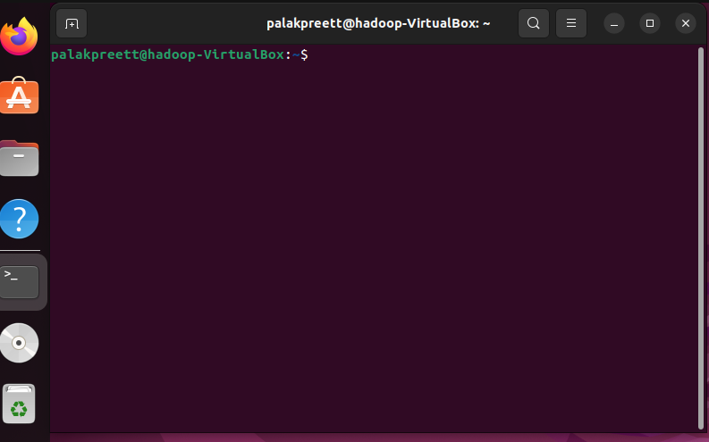

### 2 System Update
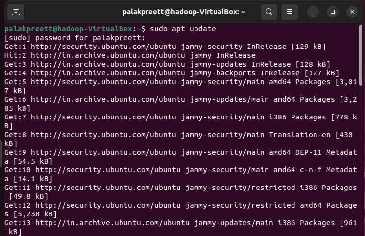

### 3 Apache Installation
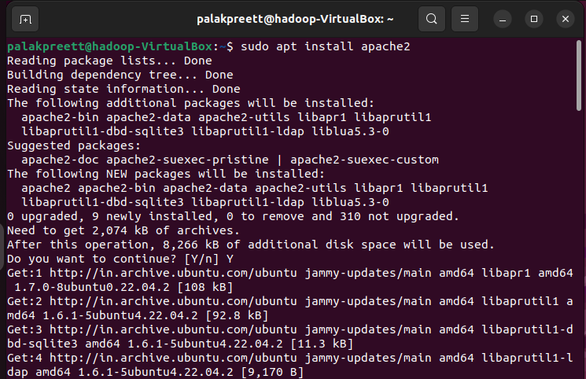

### 4 Apache Running Status
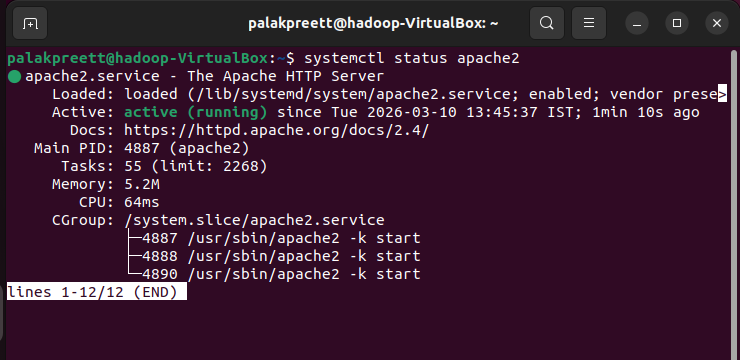

### 5 Apache Default Page
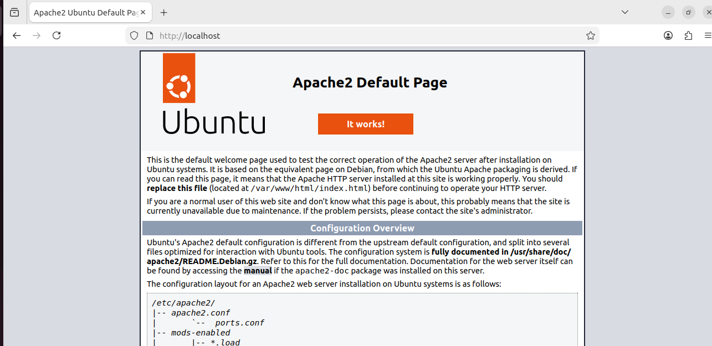

### 6 Navigating HTML Directory
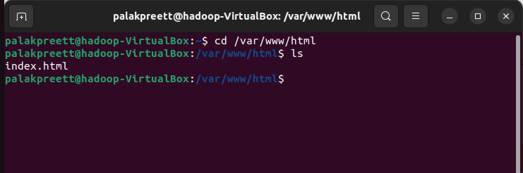

### 7 Editing index.html
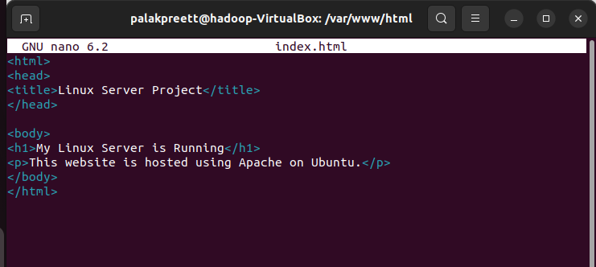

### 8 Restarting Apache
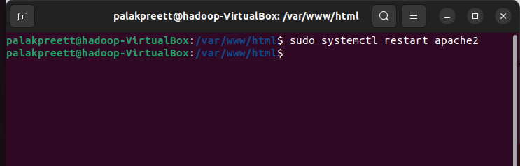

### 9 Custom Website Page
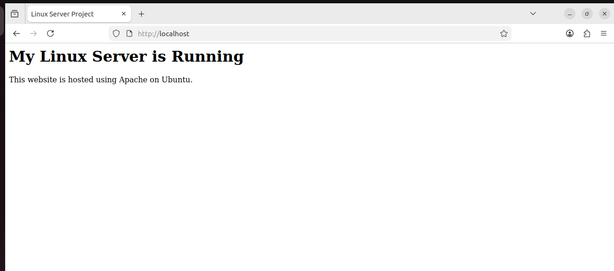

### 10 Process Monitoring (top)
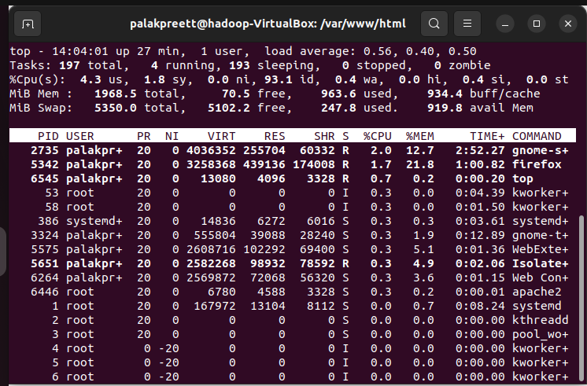

### 11 Memory Usage (free -h)
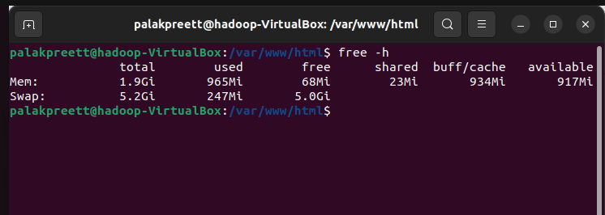

### 12 Disk Usage (df -h)
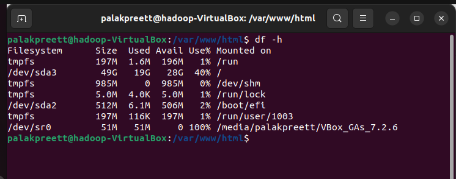

### 13 Firewall Status
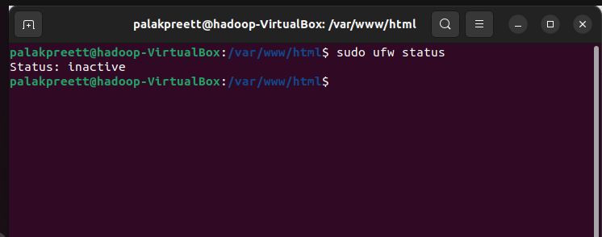

### 14 Allow Apache Through Firewall
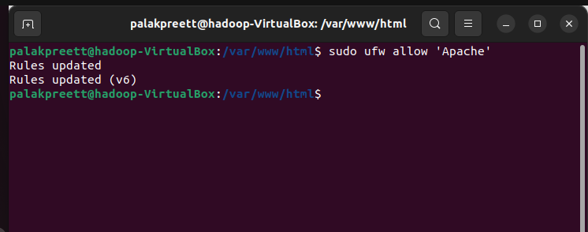

### 15 Firewall Enabled Status
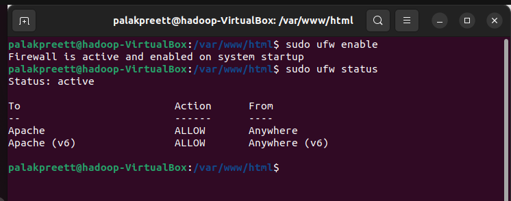
